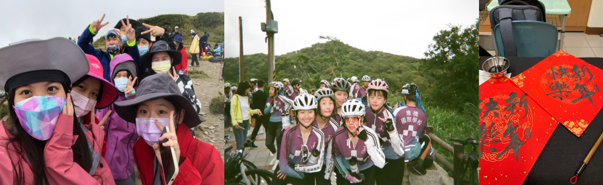
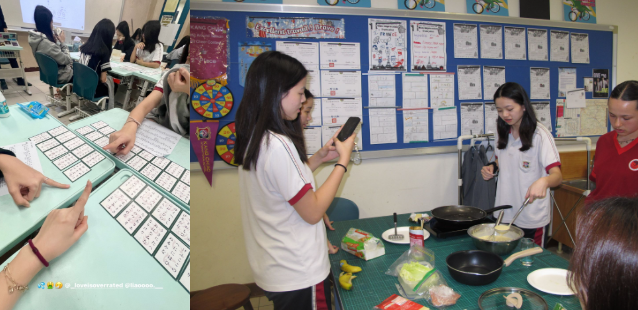
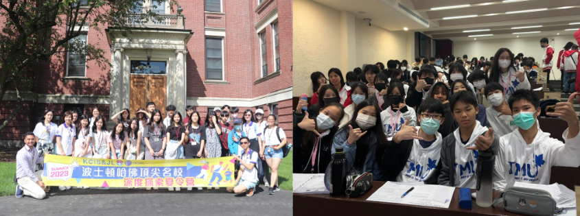

# Portfolio

## Sports/Music
- Climbing Hehuan Mountain
- Swim across the Sun Moon Lake
- Cycling around Taiwan in 12 days
- Clarinet
- Cycling Club
- Calligraphy Club

## Volunteer

- Fundraising Activities (2018-2025)
- School Peer Tutoring (2023-2024)
- Teacher Assistant (2023-2024)
- Infinitas Online Tutoring (2023-2024)
- Dormitory Assistant (2020-2021 & 2023-2025)
- City Library Volunteer (2020-2021 & 2024-2025)
- School Ambassador (2022-2024)

## Club
- Psychology Research Club
- AI Robotics Club
- Japanese Competitive Karuta Club
- Taitung Indigenous Community Service Team Club
- Virtual Founders Academy Club
- French Culture Club

## Leadership
- Secretary of the Taitung Indigenous Community Service Team Club

## Academic Camps
- National Taiwan University Python Programming
- Harvard 2023 Summer Junior MBA Program
- MacDuffie Summer School Program
- Taipei Medical University Medical Camp
- National Taiwan Normal University Business Management Camp
- National Yang Ming Chiao Tung University High School Talent Cultivation Program - Design Thinking in Big Data
- National Yang Ming Chiao Tung University High School Talent Cultivation Program - Statistical Methods and Data Analysis

